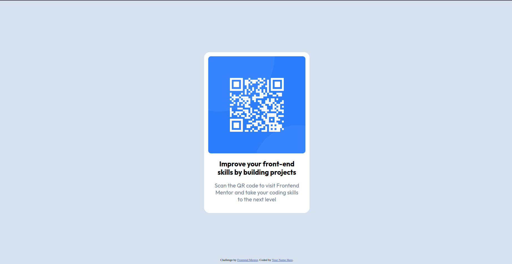

# Frontend Mentor - QR code component solution

This is a solution to the [QR code component challenge on Frontend Mentor](https://www.frontendmentor.io/challenges/qr-code-component-iux_sIO_H). Frontend Mentor challenges help you improve your coding skills by building realistic projects. 

## Overview

### Screenshot



## My process

### What I learned

Применил на пракитике знания полученные на онлайн курсе, узнал что для корректной работы:

```css:
    alighn-items: center;
```
Надо использовать:
```css:
    height: 100vh;
```
Поработал с изображенем и узнал, что шрифты надо подключать в header.

### Useful resources

https://meyerweb.com/eric/tools/css/reset/ - Сброс стилей / Reset CSS
